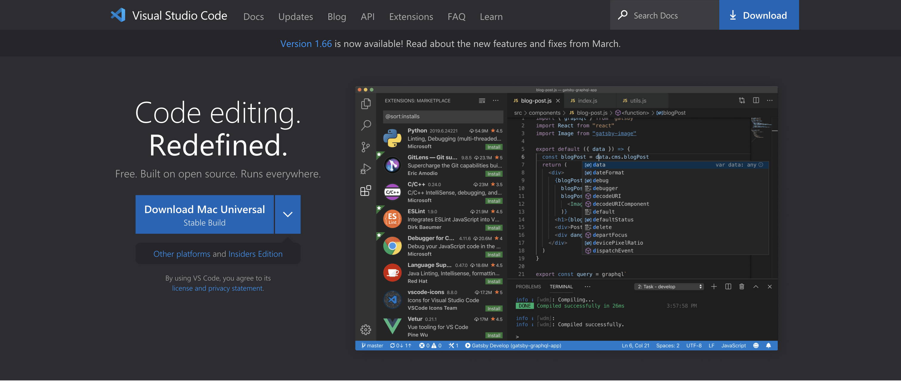
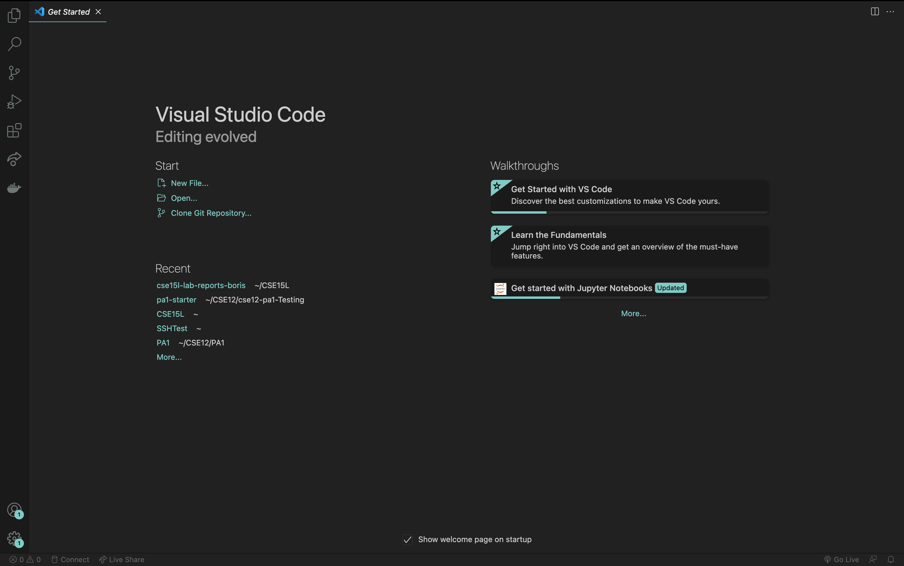
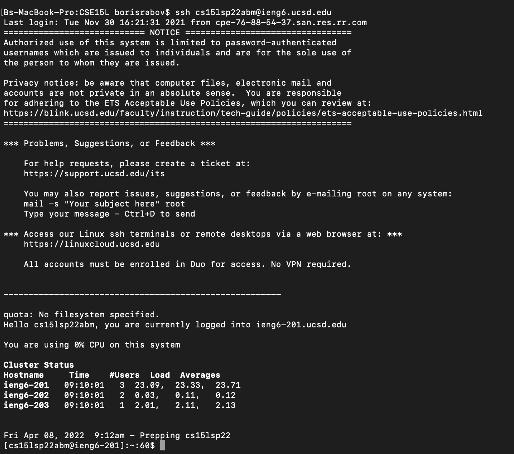
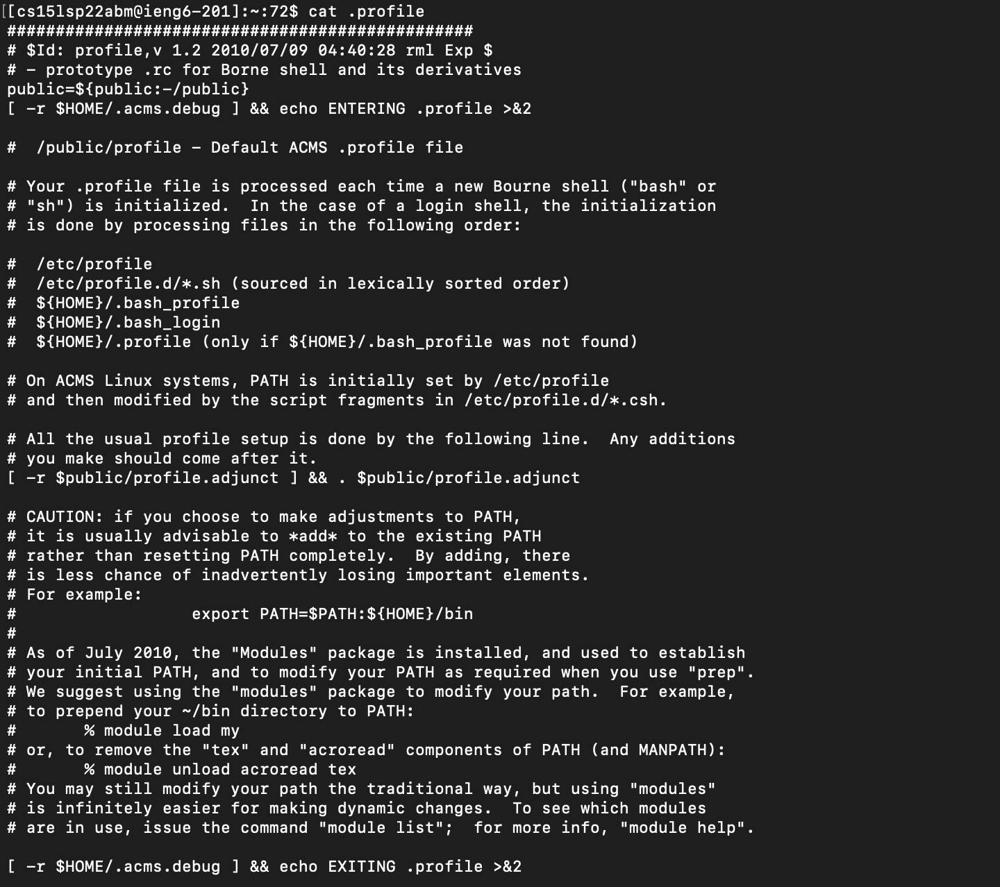

# Labs 1 and 2

[Back to main page](index.md)

During these two labs, we learned how to remotely access computers using ssh as well as the basics of git.

---

## Week 1

On week 1, we leared how to do the following:

* Installing VSCode
* Remotely Connecting to Computers Using SSH
* Learning a Bunch of Terminal Commands
* Moving Files with SCP
* Setting an SSH Key
* Optimizing Remote Running

I will go over each topic in more detail.

### Installing VSCode

VSCode is a great coding editor with many great features as well as an intuitive UI. To download VSCode, simply go to the official website of the coding editor and click the download button. The downloading process is simple and the installer will guide you through it.

[Link to VSCode website.](https://code.visualstudio.com/)



After downloading and opening the editor, you should be seeing something like this.



### Remotely Connecting to Computers Using SSH

Sometimes you will have to run code on a remote machine. For example, if you want to deploy an application to a server or simply use a remote computer for security reasons. To do that you will use **SSH** which is a secure connection protocol.

*Note, that I personally use a Mac system, and to follow this lab report on a windows machine you will have to OpenSSH from [here](https://docs.microsoft.com/en-us/windows-server/administration/openssh/openssh_install_firstuse)*

Each student in CSE15L is given a space on UCSD servers. To access this space you will have to know the name and a password for your CSE15L remote account.  

[To get or update account info for accessing CSE15L, click here.](https://sdacs.ucsd.edu/~icc/index.php)

After you looked up your CSE15L account information open terminal an type the following command.

`ssh <name>@ieng6.ucsd.edu`
Where `<name>` is your account's username.

The SSH will ask you for your password. After putting in your password, you will see something like this.



Now that you accessed your remote machine, we can learn cool terminal commands.

### Learning Terminal Commands

In CSE15L, you will work with your remote machine purely through the terminal. Thus, it is important to learn commands and what they do. Here are some of the most used ones.

* `cd <name>~` - change directory. Takes you to a folder / directory named `<name>`.
* `cd` - goes back to root. Essentially takes you back to where you landed when you accessed your remote machine with ssh.
* `ls` - lists all directories in your current directory. Basically, prints out all the folders in your current directory.
* `ls -a` - lists *all* directories in your current directory, even files.
* `cp` - copies a file to a directory or a different file.
* `cat` - prints out info and contents of the directory.

[Here is a cheathseet made by a Github user.](https://github.com/0nn0/terminal-mac-cheatsheet)

Let's try out some of these commands. For example, typing

`ls -lst`

Prints out the list of all of the files in the root directory.


If we type in

`cat .profile`

We will se the information on what this file does.



Try playing around with line commands yourself.

### Moving Files with SCP

If you want to move a file from your machine to your remote machine, you will have to use SCP. SCP, which is a Secure Copy Protocol, allows you to securely transfer your files from one computer to another. You often do this to execute the code you write on your machine remotely. Let's try moving files out!

First, you have to create a Test.java file. Put the following code into it

``` java
class Test {
    public static void main(String[] args) {
        System.out.println(System.getProperty("user.name"));
        System.out.println(System.getProperty("user.home"));
        System.out.println(System.getProperty("user.dir"));
    }
}
```

This code essentially shows info about the system the code is executed on. Try running it on your machine by putting following commands into a terminal.

`javac Test.java`
`java Test`

You will get somethig like this.


Now, to move this file to the root directory of your remote machine, type this into the terminal:
`scp Test.java <name>@ieng6.ucsd.edu:~/`
Where  `name` is your remote connection login. 

After writing your password, you will see a confirmation that the file was copied.


Now connect to your remote machine and try exhecuting the java code. You will see the information of the remote machine.


### Setting an SSH Key

Inputting a password every time you made changes to your file wastes a lot of time. To get rid of this unnecessary step we can create a public-private hash key bound. SSH is essentially a set of two files that contain 256 random digits that act as a key or as a password.

To create a public-private key set, type in the following into your terminal.

``` bash
ssh-keygen
(/Users/<user-name>/.ssh/id_rsa): /Users/<user-name>/.ssh/id_rsa
```

Where `<user-name>` is a name of your system.

You will get the following


Now, login into your remote machine and create a .ssh directory.

``` bash
ssh <name>@ieng6.ucsd.edu
mkdir .ssh
```

Back on your local machine, you will have to transfer `id_rsa.pub` to `~/.ssh/authorized_keys` directory. Do it, using what you learned about SCP from the previous section.

After transsferring your public key to the local machine, try loging into your remote machine. You will see, that it doesn't require a password anymore.

### Optimizing Remote Running

We got rid of an extra step from a process, however, we can further simplify it. When using most terminals, you can input multiple commands into one line using `""` syntax. Thus, we can write a terminal line that will make editing, moving, and executing code remotely much easier.

Thus, applying all we know about bash commands, we will get the following line.

`scp Test.java <name>@ieng6.ucsd.edu:~/; scp <name>@ieng6.ucsd.edu "javac Test.java; java Test"`
