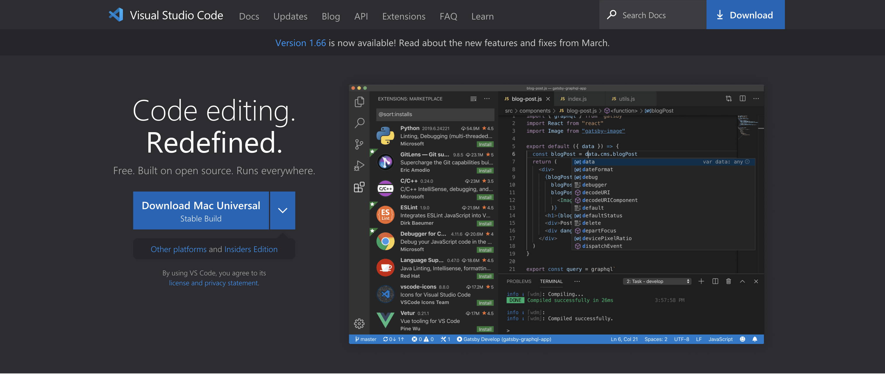
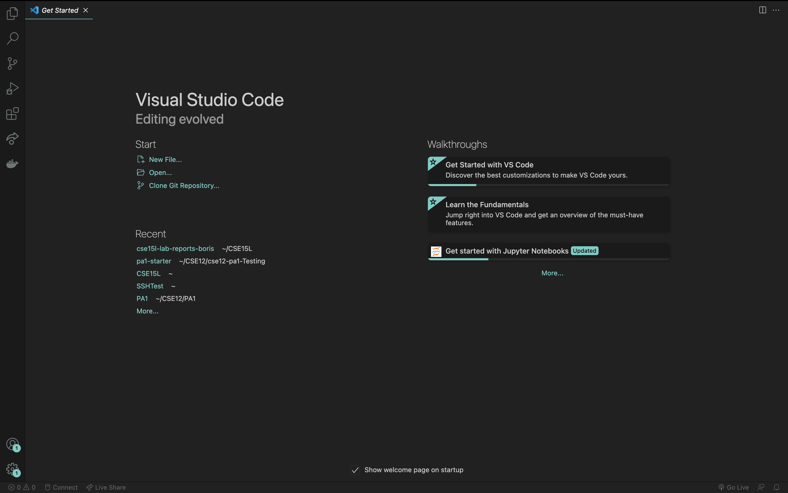
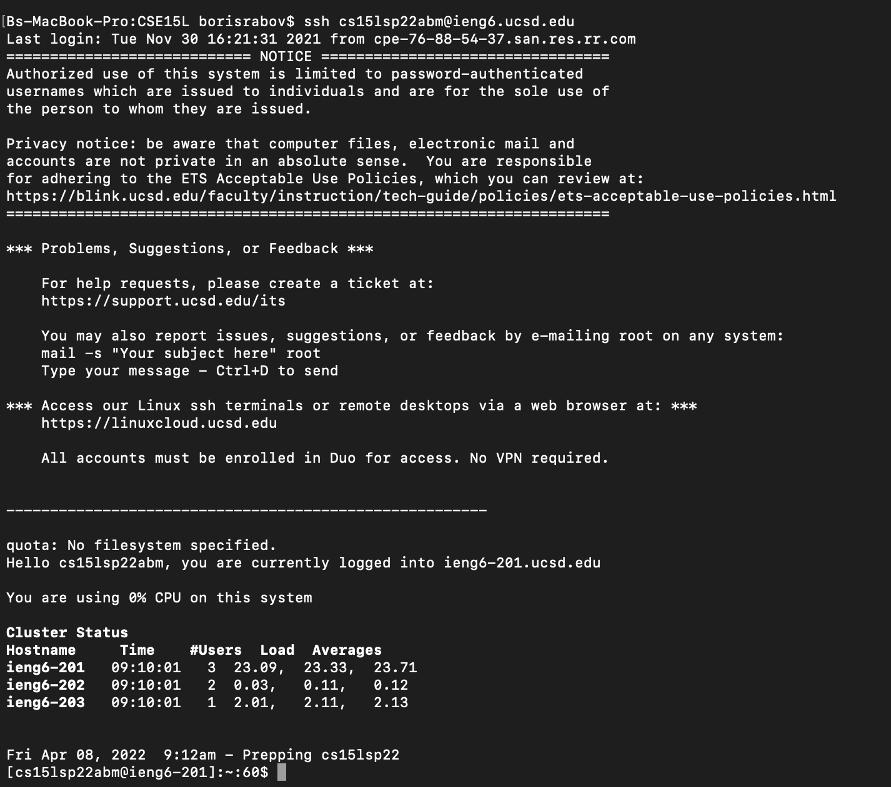
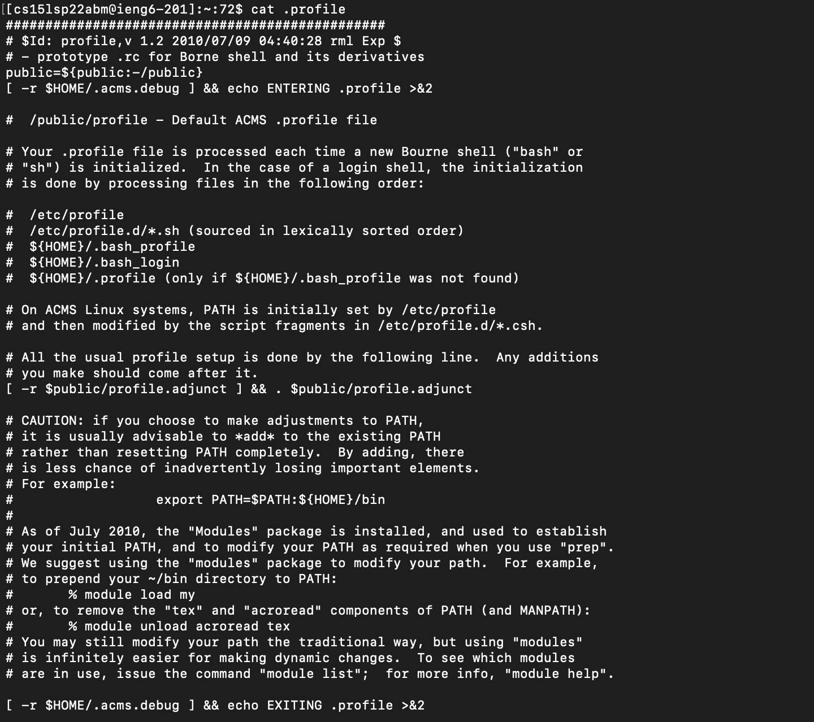

# Labs 1 and 2

During these two labs, we learned how to remotely access computers using ssh as well as the basics of git.

---

## Week 1

On week 1, we leared how to do the following:

* Installing VSCode
* Remotely Connecting to Computers Using SSH
* Learning a Bunch of Terminal Commands
* Moving Files with SCP
* Setting an SSH Key
* Optimizing Remote Running

I will go over each topic in more detail.

### Installing VSCode

VSCode is a great coding editor with many great features as well as an intuitive UI. To download VSCode, simply go to the official website of the coding editor and click the download button. The downloading process is simple and the installer will guide you through it.

[Link to VSCode website.](https://code.visualstudio.com/)

After downloading and opening the editor, you should be seeing something like this.

### Remotely Connecting to Computers Using SSH

Sometimes you will have to run code on a remote machine. For example, if you want to deploy an application to a server or simply use a remote computer for security reasons. To do that you will use **SSH** which is a secure connection protocol.

*Note, that I personally use a Mac system, and to follow this lab report on a windows machine you will have to OpenSSH from [here](https://docs.microsoft.com/en-us/windows-server/administration/openssh/openssh_install_firstuse)*

Each student in CSE15L is given a space on UCSD servers. To access this space you will have to know the name and a password for your CSE15L remote account.  

[To get or update account info for accessing CSE15L, click here.](https://sdacs.ucsd.edu/~icc/index.php)

After you looked up your CSE15L account information open terminal an type the following command.

`ssh <name>@ieng6.ucsd.edu`
Where `<name>` is your account's username.

The SSH will ask you for your password. After putting in your password, you will see something like this.

Now that you accessed your remote machine, we can learn cool terminal commands.

### Learning Terminal Commands

In CSE15L, you will work with your remote machine purely through the terminal. Thus, it is important to learn commands and what they do. Here are some of the most used ones.

* `cd <name>~` - change directory. Takes you to a folder / directory named `<name>`.
* `cd` - goes back to root. Essentially takes you back to where you landed when you accessed your remote machine with ssh.
* `ls` - lists all directories in your current directory. Basically, prints out all the folders in your current directory.
* `ls -a` - lists *all* directories in your current directory, even files.
* `cp` - copies a file to a directory or a different file.
* `cat` - prints out info and contents of the directory.

[Here is a cheathseet made by a Github user.](https://github.com/0nn0/terminal-mac-cheatsheet)

Let's try out some of these commands. For example, typing

`ls -lst`

Prints out the list of all of the files in the root directory.

If we type in

`cat .profile`

We will se the information on what this file does.

Try playing around with line commands yourself.

### Moving Files with SCP

If you want to move a file from your machine to your remote machine, you will have to use SCP. 
