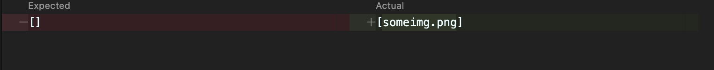

# Lab report 2

[Back to main page](index.md)

During these weeks 3 and 4 we learned the basics of testing for Java and incremental development.

---

## Code Change 1

1. [Test File](https://github.com/dzodkin33/markdown-parser/blob/main/test-img.md)

2. **Symptom:**

3. The parcer doesn't recognize that if there's a symbol in front of the '(' then it's not considered a link in markdown.

## Code Change 2

1. [Test file](https://github.com/dzodkin33/markdown-parser/blob/main/test-break.md)

2. **Symptom:**

3. Because  we don't specify what counts as a full link, the parcer for some reason runs an infinite/extreamly loop reading all of the pages of google.com rather then links of google itself.

## Code Change 3

1. [Test file](https://github.com/dzodkin33/markdown-parser/blob/main/test-img.md)

2. **Symptom:**

3. This change fixes code chang 1 as its finally skips the invalid links. Previously, even if the corrupt link was incountered, the parcer would still consider its contents as a link and would return it.