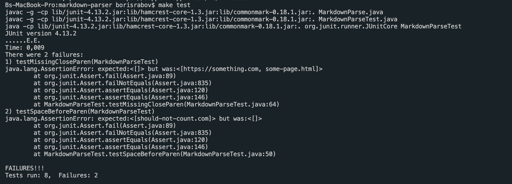
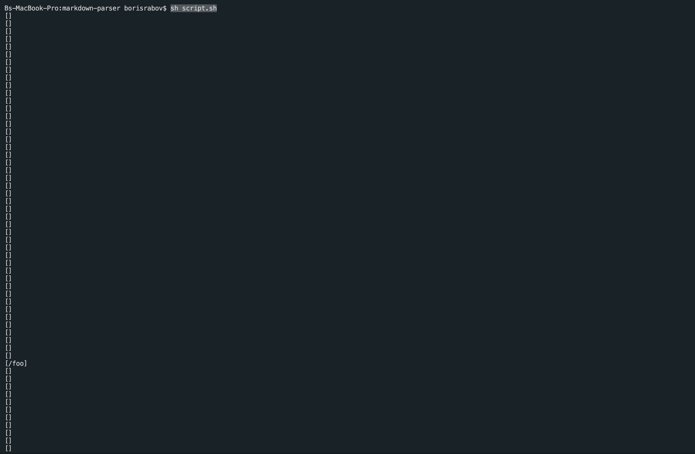

# Lab Report 5

[Back to main page](index.md)

In this lab report, we use `vimdiff` for debugging the markdown parser.

---

## Studying the code and test cases.

First, let's run `make test` to make sure that ctests compile. We get two faild tests that we will ignore for now.

Then, we would run the `script.sh` by using a termianl command `time bash script.sh`. We get 652 different lines with different outputs. It took us about 30 seconds to run these tests.

Then, in order to use `vimdiff` properly to describe the difference in code implementation, I copied the markdown-parser from GitHub and my own machine using the `scp` command. Here how these files are located in the remote machine.

[Here is a link to my version of parser](https://github.com/dzodkin33/my-markdown-parser)

Now, let's call `vimdiff` to compare `results.txt` files of both markdown parsers in order to find tests with different results.

In this case, my parser's results are located on the right and course's makrdown - are on the left.

I will use [CommonMark](https://spec.commonmark.org/dingus/?text=%5Blink%5D(foo%20bar)%0A%0A) to determine the expected output. I decided to choose tests 490 and 495 for my debugging.

## Test 490 bug

[The Link to test 490 in Github](https://raw.githubusercontent.com/nidhidhamnani/markdown-parser/main/test-files/490.md)

Let's compare two actuall outputs with the expected outpust.

These are actuall outputs:

That is the expected output:

Thus, we can determine that my implementation is incorrect. The issue in my code is that, although it recognizes that links would be inside the brackets. However, my implementation still recognizes the symbol for a new line `\n` is still a proper symbol.

The way to fix this bug is to add an if statement that checks if the possible link contains a \n symbol, that is responsible for the new line. Here is where and how I changed my code.

* Where

* How

Now, let's run the test and check the result.

### Test bug 495

[The Link to test 495 in Github](https://raw.githubusercontent.com/nidhidhamnani/markdown-parser/main/test-files/495.md)

These are actuall outputs:

That is the expected output:

My version of the parser was wrong. The issue is that my code finds the first `)` in the insides of the link and cuts off the rest of the link, even if it contains anything else. Here is the screenshot of where the bug is located.

